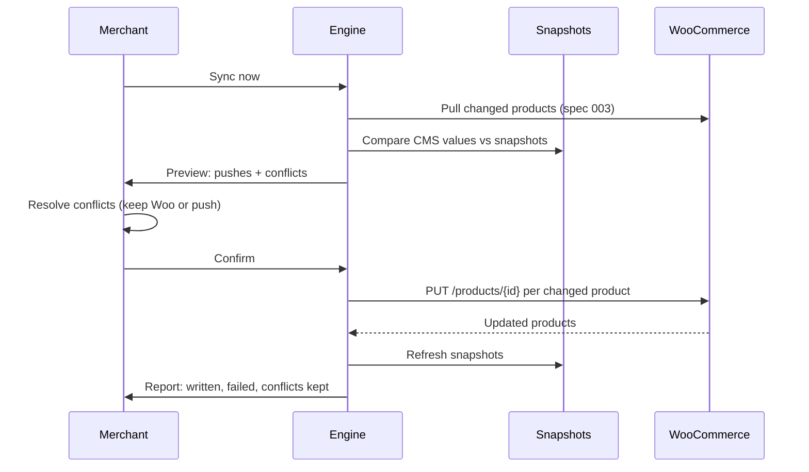

# Spec 004: Two-Way Sync (Framer to WooCommerce Write-Back)

Status: MVP. Feature: `docs/FEATURES.md` M11.

## 1. Problem statement

Merchants edit stock, prices, and copy directly in Framer CMS and need those changes pushed back to WooCommerce. Write-back must be field-scoped, previewed before it runs, safe against conflicts when both sides changed, and impossible to delete store data.

## 2. Data model decision

- **Snapshots** (plugin data, written during pull by spec 003): per item, per two-way field, the last-synced value. Read path: before push, engine compares current CMS value against snapshot. Write path: after a successful write, snapshot is refreshed to the pushed value.
- **Mapping directions** (plugin data): per field `one-way` (default) or `two-way`. Only provider-writable fields (`stockQuantity`, `regularPrice`, `salePrice`, `sku`, `name`, `description`, `shortDescription`, `status`, `weight`) can be switched to two-way.
- **PendingChange** (component state): `{ itemWooId, field, wooValue, framerValue, resolution: "pending" | "push" | "keep-woo" }`.

Change classification: CMS value ≠ snapshot AND Woo value = snapshot → push. CMS value ≠ snapshot AND Woo value ≠ snapshot → conflict. CMS value = snapshot → skip.

## 3. Platform API operations

- `PUT /wp-json/wc/v3/products/{id}` with only the changed fields grouped per product (1 request per product with changes).
- `POST /wp-json/wc/v3/products/batch` with `update: [{id, ...fields}]` when more than 10 products change in one run (1 request per 100 products).
- Stock writes include `manage_stock: true` alongside `stock_quantity`.
- Requires a passing CORS preflight (`OPTIONS` with PUT/POST allowed), checked in spec 002.

## 4. Credentials required

`read_write` key scope. If the connection holds `read` keys, enabling any two-way field prompts the upgrade flow with a plain-language explanation. Permission failure on write (401/403 on PUT) surfaces "Your API key does not allow changes to the store. Create a key with read/write permission and reconnect." No `framer.json` change.

## 5. Triggers consumed

User actions: "Sync now" (pull then push phases), "Review changes" confirm, conflict resolution choices. No webhooks.

## 6. File-by-file change list

- `src/sync/conflict.ts`: classification (push/conflict/skip), resolution application, new.
- `src/sync/engine.ts`: `runPush(pendingChanges, signal)` after pull, batch grouping, extend.
- `src/storage/snapshots.ts`: refresh after successful writes, extend.
- `src/views/WriteBackReviewModal.tsx`: diff table (field, store value, Framer value), confirm gate, new.
- `src/views/ConflictResolutionModal.tsx`: per-conflict choice, "Keep store value" default, new.
- `src/components/sync/WriteBackDiff.tsx`: reusable diff row, new.
- `src/views/MappingModal.tsx`: two-way direction Switch enabled only for provider-writable fields, extend.
- `src/views/ConnectionModal.tsx`: read_write upgrade flow, extend.
- `docs/help/Sync Inventory Both Ways.md`: new, same run.

## 7. Acceptance criteria

1. Given no user confirmation in the review modal, zero write requests reach WooCommerce (mock transport assertion).
2. Given 3 products with changed stock fields, exactly 3 PUT requests fire, each containing only the changed fields, and `manage_stock: true` rides along with stock writes.
3. Given 15 changed products, writes go through `POST /products/batch` with `update` arrays of at most 100.
4. Given a field changed both in Woo and in Framer since last sync, the conflict appears in the resolution modal; unresolved conflicts default to the Woo value and are listed in the report.
5. Given a successful write, the snapshot for that field equals the pushed value (no re-push on the next run; idempotency test).
6. Given 401 on PUT, the run stops pushing, the report shows the permission sentence from section 4, and snapshots are not refreshed for the failed items.
7. Given a direction set to one-way for a field, edits to that field in Framer never produce a write request.
8. Given images or variations in the mapping, they cannot be set two-way (Switch disabled with help text "Images and variants are read-only for now.").
9. The engine never issues a DELETE request (mock transport asserts only GET/PUT/POST occur).
10. All strings pass the UX writing rules test.

## 8. Open questions

- Decimal formatting on price round-trips (Woo returns strings like "21.99"): normalize through the mapper and verify no float drift; needs a fixture test decision.
- Should batch write size lower to 50 for very slow hosts? Default 100 assumed.

## Always answer these four

- **Removed then re-added plugin**: snapshots are lost with plugin data. First sync after reconnect runs with empty snapshots: everything classifies as "no local change" (CMS = snapshot unknown), so nothing is pushed; snapshots rebuild during that pull. Safe by default.
- **Framer plan limit mid-sync**: push reads existing CMS values; item creation limits do not apply. CMS read errors pause the run with the standard retry report.
- **Partial sync failure and retry**: writes are per product (or per batch chunk); failures are itemized, failed snapshots are not refreshed, retry re-attempts only pending items; confirmed pushes never repeat (snapshot guard).
- **Unusually large catalog**: writes only touch changed items, so catalog size does not inflate write count; batch endpoint caps requests at 1 per 100 changed products; 429 backoff applies to writes as to reads.
